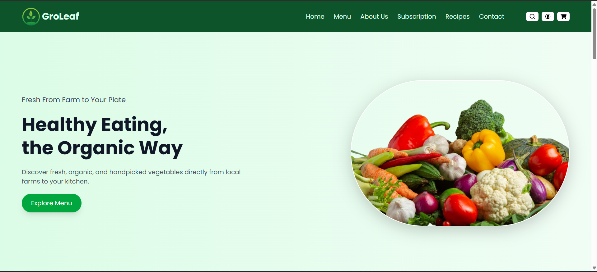

# 🌿 Groleaf - Organic Vegetable Web App

**Groleaf** is a responsive and modern web application for showcasing and promoting organic vegetables. Built with **React.js** and styled using **Tailwind CSS**, this project offers an eco-friendly UI design, mobile responsiveness, and clean component architecture.

## 🚀 Features

- 🍅 Beautiful landing page for organic produce
- 📱 Fully responsive design
- ⚡ Fast performance using React and Vite
- 🎨 Styled with Tailwind CSS utility classes
- 🔄 Dynamic and reusable components
- 🧭 Smooth navigation with React Router
- 🌱 Easily customizable for farms, organic shops, or agriculture startups

---

## 📁 Project Structure

```bash

groleaf-react/
├── public/
│   └── images/
├── src/
│   ├── assets/
│   ├── components/
│   ├── pages/
│   ├── App.jsx
│   └── main.jsx
├── tailwind.config.js
├── postcss.config.js
├── index.html
└── package.json

## 🛠️ Installation

git clone https://github.com/dev-debabrata/groleaf-react.git

cd groleaf-react

npm install

npm run dev

```

---

## 🔧 Tech Stack

React.js

Tailwind CSS

Vite

---

## 🖼️ Screenshots


